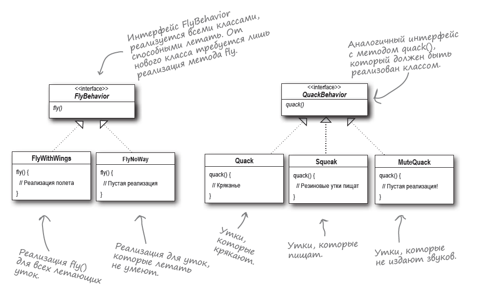
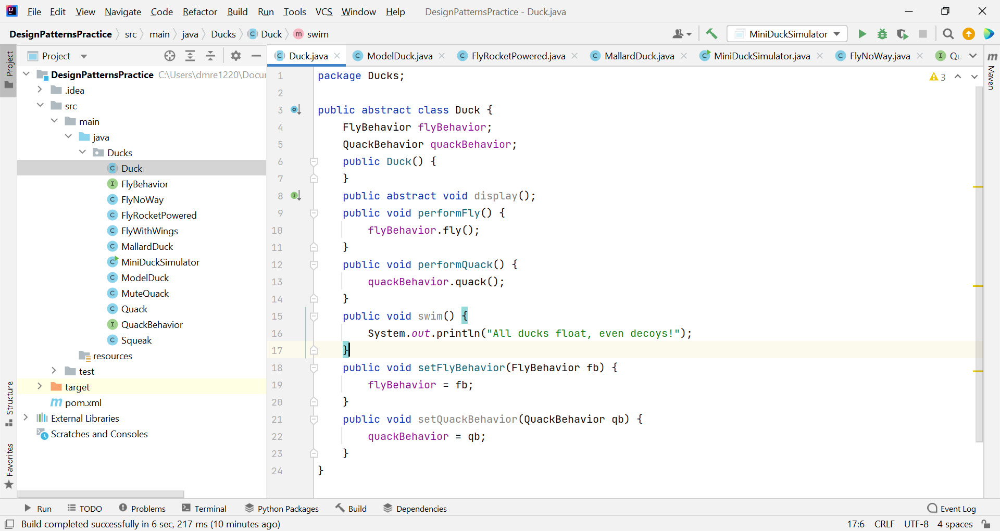
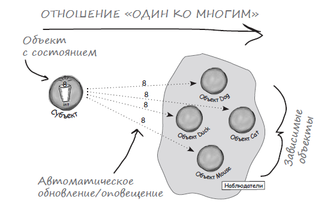
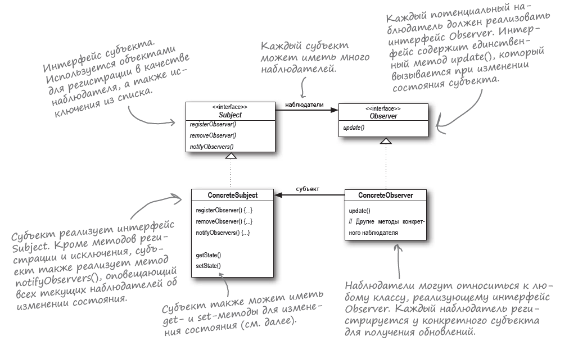

# HeadFirst-Design-Patterns

---
| Номер главы | Название главы | Страницы | Тезисы |
| :---: | :---: | :---: | :---: |
| - | ~~Введение~~ | 25 - 36 ( страниц) | |
| 1 | ~~Добро пожаловать в мир паттернов: знакомство с паттернами~~ | 37 - 70 (34 страницы) | Паттерн Стратегия позволяет нам создавать семейства алгоритмов, которые связаны между собой, при этом инкапсулированы и взаимозаменяемы. Также у нас есть возможность гибко модифицировать эти алгоритмы. Ассоциация: утки разных видов (живые, резиновые, приманки) и классы, реализующие их действия. Важно: программировать на уровне интерфейсов, а не реализаций. |
| 2 | Объекты в курсе событий: паттерн Наблюдатель | 71 - 110 (40 страниц) |
| 3 | Украшение объектов: паттерн Декоратор | 111 - 140 (30 страниц) |
| 4 | Домашняя ОО-выпечка: паттерн Фабрика | 141 - 198 (58 страниц) |
| 5 | Уникальные объекты: паттерн Одиночка | 199 - 218 (20 страниц) |
| 6 | Инкапсуляция вызова: паттерн Команда | 219 - 264 (46 страниц) |
| 7 | Умение приспосабливаться: паттерны Адаптер и Фасад | 265 - 302 (38 страниц) |
| 8 | Инкапсуляция алгоритмов: паттерн Шаблонный Метод | 303 - 340 (38 страниц) |
| 9 | Управляемые коллекции: паттерны Итератор и Компоновщик | 341 - 402 (62 страницы) |
| 10 | Состояние дел: паттерн Состояние | 403 - 446 (44 страницы) |
| 11 | Управление доступом к объектам: паттерн Заместитель | 447 - 512 (66 страниц) |
| 12 | Паттерны паттернов: составные паттерны | 513 - 580 (68 страниц) |
| 13 | Паттерны в реальном мире: паттерны для лучшей жизни | 581 - 614 (34 страницы) |
| 14 | Приложение: другие паттерны | 615 - 634 (20 страниц) |
---
### Глава № 1. Добро пожаловать в мир паттернов: знакомство с паттернами

**Принцип проектирования:** **_Выделите аспекты приложения, которые могут изменяться, и отделите их от тех, которые всегда остаются постоянными._**

Выделите то, что изменяется и "инкапсулируйте" эти аспекты, чтобы они не влияли на работу остального кода. Как результат, меньше непредвиденных последствий от изменения кода, бóльшая гибкость наших систем, когда мы будем что-то изменять или расширять.

То есть, если у нас есть некий суперкласс Duck, реализующий утку, то мы можем вынести реализацию каких-то его действий (таких, как полет и умение крякать) в отдельные группы классов.

**Принцип проектирования:** **_Программируйте на уровне интерфейса, а не на уровне реализации._**

То есть, мы должны для какого-то действия создать интерфейсы, например, FlyBehavior и QuackBehavior. А далее эти интерфейсы уже реализовывать своими классами: FlyWithWings, FlyNoWay (для резиновой уточки) и тд. При этом интерфейс поведения теперь реализуется не суперклассом Duck, как мы делали раньше, а классом поведения. В этой ситуации классам Duck не нужно знать подробности реализации своих аспектов поведения, а реализация поведения в свою очередь не привязывается к субклассу Duck.

**При этом интерфейс является супертипом, то есть программирование на уровне интерфейса необязательно должно использовать Java-конструкцию interface, супертипом может быть и абстрактный класс.**

Такая архитектура позволяет использовать поведение fly() и quack() в других типах объектов, потому что это поведение не скрывается в классах Duck. Кроме того, мы можем добавлять новые аспекты поведения без изменения существующих классов поведения и без последствий для классов Duck, *использующих* существующее поведение. - все преимущества ПОВТОРНОГО ИСПОЛЬЗОВАНИЯ без недостатков, присущих наследованию.

Так я реализовал структуру классов с различными типами поведения для уток, используя интерфейсы для способностей к действию уток, будь то полет или возможность издавать звуки, а самих уток реализовал через классы расширяющие абстрактный класс Duck с общими для всех уток методами и переменными, имеющими полимфорфические типы.

**Отношение СОДЕРЖИТ бывают удобнее отношений ЯВЛЯЕТСЯ**. Каждая утка СОДЕРЖИТ экземпляры FlyBehavior и QuackBehavior, которым делегируется выполнение соответствующих операций. Подобные связи между двумя классами означают, что мы используем механизм _композиции_. Поведение не наследуется, а предоставляется правильно выбранным объектом.

**Принцип проектирования:** **_Отдавайте предпочтение композиции перед наследованием._**

Сейчас мы использовали паттерн проектирования СТРАТЕГИЯ. Благодаря использованию данного паттерна проект может быть готов к любым доработкам, которые возникают в фантазии начальства.

А теперь, когда мы прошли довольно долгий путь к конечной цели, приведем формальное определение: **_Паттерн Стратегия_ определяет семейство алгоритмов, инкапусулирует каждый из них и обеспечивает их взаимозаменяемость. Он позволяет модифицировать алгоритмы независимо от их использования на стороне клиента.**

Использование паттернов упрощает общение между разработчиками. Так, использование паттернов в общении не сводится к общей терминологии. Вы также передаете целый набор характеристик, качеств и ограничений, представленных данным паттерном. Если мы упомянем паттерны, разработчики сразу могут понять суть решения, о которой мы говорим.

Знание таких концепций, как абстракция, наследование и полиморфизм, еще не делает из вас хорошего ОО-проектировщика. Истинный гуру проектирования стремится создавать гибкие архитектуры, способные адаптироваться к изменениям.

### Глава № 2. Объекты в курсе событий: паттерн Наблюдатель

Чтобы понять паттерн Наблюдатель, можно представить модель подписки на газетную рассылку: получатели газеты - это наблюдатели, а издатель - это субъект. Формально данный паттерн определяется так:

**_Паттерн Наблюдатель_ определяет отношение «один ко многим» между объектами таким образом, что при изменении состояния одного объекта происходит автоматическое оповещение и обновление всех зависимых объектов.**

Графически паттерн можно представить следующим образом:

Субъект и наблюдатели определяют отношение «один ко многим». Имеется один субъект, который уведомляет многих наблюдателей об изменениях в субъекте. Наблюдатели зависят от субъекта: при изменении состояния последнего наблюдатели получают оповещения.

Рассмотрим структуру паттерна Наблюдатель с классами Subject и Observer. Диаграмма классов выглядит так:

#### Сила слабых связей

Когда два объекта слабо связаны, они могут взаимодействовать друг с другом, но обычно обладают минимумом информации друг о друге. По сути своей архитектуры со слабыми связями часто обладают большой гибкостью. В свою очередь паттерн Наблюдатель является отличным примером слабого связывания. А вот как паттерн достигает слабого связывания:
- Единственное, что знает субъект о наблюдателе, — то, что тот реализует некоторый интерфейс (Observer).
- Новые наблюдатели могут добавляться в любой момент.
- Добавление новых типов наблюдателей не требует модификации субъекта.
- Субъекты и наблюдатели могут повторно использоваться независимо друг от друга.
- Изменения в субъекте или наблюдателе не влияют на другую сторону.

**Принцип проектирования:** **_Стремитесь к слабой связанности взаимодействующих объектов._**

**На базе слабосвязанных архитектур строятся гибкие ОО-системы, которые хорошо адаптируются к изменениям благодаря минимальным зависимостям между объектами.**

### Глава № 3. Украшение объектов: паттерн Декоратор

**Принцип проектирования: _Классы должны быть открыты для расширения, но закрыты для изменения._**

На первый взгляд формулировка принципа кажется противоречивой, однако существуют приемы, обеспечивающие возможность расширения кода без его модификации. Стоит быть осторожным с выбором расширяемых областей. ПОВСЕМЕСТНОЕ применение принципа открытости/закрытости неэффективно и расточительно, оно приводит к созданию сложного, малопонятного кода.

*Пока мое определение:* Декораторы - это объекты, которые вбирают в себя исходный объект и оборачивают своей дополнительной функциональностью. Так можно выделить следующие моменты:
- Декораторы имеют тот же супертип, что и декорируемые объекты.
- Объект можно «завернуть» в один или несколько декораторов.
- Так как декоратор относится к тому же супертипу, что и декорируемый объект, мы можем передать декорированный объект вместо исходного. 
- Декоратор добавляет свое поведение до и (или) после делегирования операций декорируемому объекту, выполняющему остальную работу.
- Объект может быть декорирован в любой момент времени, так что мы можем декорировать объекты динамически и с произвольным количеством декораторов.